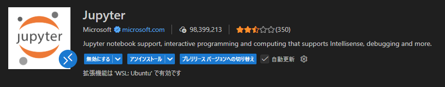

### Using Examples
### Prompt Cues
# プロンプトエンジニアリング基礎

[](https://youtu.be/GElCu2kUlRs?si=qrXsBvXnCW12epb8)

## はじめに
このモジュールでは、生成AIモデルに対して効果的なプロンプトを作成するための基本的な概念と手法を扱います。LLM（大規模言語モデル）へのプロンプトの書き方は重要です。工夫されたプロンプトはより高品質な応答を引き出します。しかし、「プロンプト」や「プロンプトエンジニアリング」といった用語は具体的に何を意味するのでしょうか？また、LLM に送るプロンプト（入力）をどのように改善すればよいのでしょうか？これらは本章と次章で答えを探していく問いです。

生成AIは、ユーザーの要求に応じて新しいコンテンツ（例：テキスト、画像、音声、コードなど）を生成できます。これは、自然言語やコードの処理に長けた OpenAI の GPT（"Generative Pre-trained Transformer"）シリーズのような大規模言語モデルを用いることで実現します。

ユーザーはチャットのような馴染みのある対話形式でこれらのモデルとやり取りでき、特別な技術的知識は不要です。モデルは"プロンプトベース"で動作し、ユーザーがテキスト入力（プロンプト）を送ると AI の応答（コンプリーション）が返ってきます。ユーザーはその応答を受けてプロンプトを繰り返し改善し、期待に沿う結果が得られるまで多回合の会話を行うことができます。

「プロンプト」は生成AIアプリの主要なプログラミングインターフェイスになり、モデルに何をさせるかを指示し、返される応答の品質に影響を与えます。"プロンプトエンジニアリング"は、望ましい応答を安定して得るためにプロンプトを設計・最適化する分野として急速に注目されています。

## 学習目標

このレッスンでは、プロンプトエンジニアリングとは何か、なぜ重要なのか、そして特定のモデルやアプリケーションの目的に応じてより効果的なプロンプトを作る方法を学びます。主要な概念とベストプラクティスを理解し、Jupyter Notebook のインタラクティブな「サンドボックス」環境で実際の例を試せるようになります。

このレッスンを終えると、以下ができるようになります：

1. プロンプトエンジニアリングとは何か、その重要性を説明できる。
2. プロンプトの構成要素とその使い方を説明できる。
3. プロンプトエンジニアリングのベストプラクティスと手法を学ぶ。
4. 学んだ手法を実際の例（OpenAI エンドポイントを使用）に適用できる。

## キー用語

プロンプトエンジニアリング：モデルに望ましい出力を導くために入力を設計・改善する実践。
トークン化（Tokenization）：テキストをモデルが理解・処理できる小さな単位（トークン）に変換する処理。
命令調整済みLLM（Instruction-Tuned LLMs）：指示に従う性能を高めるために追加学習された大規模言語モデル。

## 学習用サンドボックス

プロンプトエンジニアリングは現時点では「芸術」に近く、直感と試行錯誤を重ねることで習得が進みます。本章で紹介する Jupyter Notebook は学んだことを実際に試せるサンドボックス環境を提供します。演習を実行するために必要なものは次の通りです。

1. **Azure OpenAI API キー** - 配備された LLM のサービスエンドポイント。
2. **Python 実行環境** - Notebook を動かすためのランタイム。
3. **ローカル環境変数** - 今すぐ [SETUP](./../00-course-setup/02-setup-local.md?WT.mc_id=academic-105485-koreyst) の手順を完了してください。

ノートブックにはスターター演習が準備されていますが、独自に Markdown（説明）や Code（プロンプト要求）セルを追加して試し、プロンプト設計の直感を磨くことを推奨します。

## 図解ガイド

このレッスンの全体像を先に把握したい場合は、図解ガイドをご覧ください。主要トピックと各トピックで考えるべきポイントが示されており、基礎概念からそれに対処するプロンプト設計手法までの道筋が分かります。図解内の「高度な手法」は次章で扱う内容を指します。


## スタートアップにおける応用

このトピックが、私たちの「教育への AI イノベーション提供」というスタートアップミッションにどう関係するかを考えてみましょう。パーソナライズされた学習を実現する AI アプリを構築する際に、異なるユーザーがどのようにプロンプトを設計するかを想像してみます：

- **管理者**：カリキュラムデータを解析してカバレッジの欠落を特定するよう AI に依頼する。AI は結果を要約したり、コードで可視化したりできる。
- **教育者**：対象とトピックに合わせたレッスンプランを生成するよう AI に依頼する。AI は指定フォーマットで個別化された計画を作成できる。
- **学習者**：難しい科目のチュータリングを AI に依頼する。AI は学習者のレベルに合わせたレッスン、ヒント、例を提示できる。

可能性はこれだけにとどまりません。教育分野向けにキュレーションされたオープンソースのプロンプトライブラリ [Prompts For Education](https://github.com/microsoft/prompts-for-edu/tree/main?WT.mc_id=academic-105485-koreyst) も参照して、幅広い活用例を試してみてください。サンドボックスや OpenAI Playground でそれらのプロンプトを実行してみることをおすすめします。

<!--
LESSON TEMPLATE:
This unit should cover core concept #1.
Reinforce the concept with examples and references.

CONCEPT #1:
Prompt Engineering.
Define it and explain why it is needed.
-->

## プロンプトエンジニアリングとは何か

本章では、**プロンプトエンジニアリング**を「特定のアプリケーション目標とモデルに対して、一貫性のある高品質な応答（コンプリーション）を得るために、テキスト入力（プロンプト）を設計・最適化するプロセス」と定義しました。このプロセスは大きく次の2段階と考えられます：

- 初期プロンプトの**設計**（与えたいタスクと目的に合わせて作る）
- 応答品質を高めるための**反復的な改良**（試行錯誤で調整する）

最適化は試行錯誤を伴うため直感や労力が必要です。なぜ重要かを理解するために、まず次の3つの概念を押さえましょう：

- トークン化（Tokenization）＝モデルがプロンプトをどう「見る」か
- 基盤モデル（Base LLM）＝基礎モデルがプロンプトをどう「処理」するか
- 命令調整済みLLM（Instruction-Tuned LLM）＝モデルが「タスク」をどう捉えるか

### トークン化

LLM はプロンプトを _トークンの列_ として扱います。モデルやモデルのバージョンによって、同じプロンプトが異なる方法でトークン化されることがあります。LLM はトークン単位で学習されているため、プロンプトのトークン化の仕方は生成される応答の品質に直接影響します。

トークン化の仕組みを直感的に理解するために、[OpenAI Tokenizer](https://platform.openai.com/tokenizer?WT.mc_id=academic-105485-koreyst) のようなツールを試してみてください。プロンプトを貼り付けるとどのようにトークン化されるかが分かり、空白や句読点の扱いにも注意できます。なお、この例は古い LLM（GPT-3）の例を示しているため、新しいモデルでは異なる結果になる可能性があります。


### 概念：基盤モデル（Foundation Models）

一度プロンプトがトークン化されると、[基盤モデル（Base LLM）](https://blog.gopenai.com/an-introduction-to-base-and-instruction-tuned-large-language-models-8de102c785a6?WT.mc_id=academic-105485-koreyst) の主な役割は、次に来るトークンを予測することです。膨大なテキストデータで学習された LLM はトークン間の統計的関係を把握しており、次に来るトークンをある程度の確信を持って予測できます。ここで注意すべきは、モデルは単語の「意味」を理解しているのではなく、次の予測を行うためのパターンを見ているという点です。ユーザーの介入や事前条件が満たされるまでトークン予測を続けます。

上記のプロンプトでプロンプトベースの補完がどのように動くかを確認するには、Azure OpenAI Studio の [_Chat Playground_](https://oai.azure.com/playground?WT.mc_id=academic-105485-koreyst) に入力して試してみてください。システムはプロンプトを情報要求として扱い、期待されるコンプリーションを返すはずです。

ただし、ユーザーが特定の条件や形式に合った応答を望む場合もあります。そのような場合に役立つのが命令調整済み LLM です。


### 概念：命令調整済み LLM

[命令調整済み LLM](https://blog.gopenai.com/an-introduction-to-base-and-instruction-tuned-large-language-models-8de102c785a6?WT.mc_id=academic-105485-koreyst) は、基盤モデルを出発点に、明確な指示を含む入出力例（マルチターンの "messages" など）で微調整され、与えられた指示に従うよう学習されています。

RLHF（Human Feedback を用いた強化学習）のような手法を用いることにより、モデルは指示に従う能力やフィードバックから学習する能力を得て、実用的で関連性の高い応答を生成しやすくなります。

試してみましょう。先ほどのプロンプトに対し、システムメッセージを次のように変更してコンテキストを与えます：

> _与えられた内容を小学2年生向けに要約してください。結果は1段落にまとめ、3〜5の箇条書きを含めてください。_

このように指示を加えると、生成結果は指定した目的や形式に合わせて調整されます。教育者はこの応答をスライドなどで直接利用できます。


## なぜプロンプトエンジニアリングが必要か

プロンプトが LLM によってどのように処理されるかが分かったところで、なぜプロンプトエンジニアリングが必要なのかを見ていきます。現在の LLM には、信頼性や一貫性のあるコンプリーションを得るうえで課題があるため、プロンプトの工夫と最適化が求められます。例えば：

1. **モデルの応答は確率的（stochastic）である。** 同一のプロンプトでもモデルやバージョンによって異なる応答が返ることがあり、同一モデルでも時間によって結果が変わることがあります。プロンプトエンジニアリングはこうした変動を抑えるためのガードレールを提供します。

2. **モデルは虚偽（fabrication）を生成することがある。** モデルは大規模だが有限のデータで事前学習されているため、学習データ外の事実について誤った情報を生成する場合があります。そのため、不正確または架空の情報を生成することがあり得ます。プロンプト設計の手法は、引用を求める、推論を求めるなどの工夫でこうした虚偽を検出・軽減する助けになります。

3. **モデルの能力は世代や実装によって異なる。** 新しいモデル世代はより高い能力を持つ一方で、コストや挙動の違いといったトレードオフも存在します。プロンプトエンジニアリングにより、モデル固有の差異を抽象化して、スケーラブルかつシームレスに適応できるワークフローやベストプラクティスを構築できます。

これを OpenAI や Azure OpenAI の Playground で実際に試してみてください：

- 異なる LLM デプロイメント（OpenAI、Azure OpenAI、Hugging Face など）で同じプロンプトを使うと、どのように応答が変わるか確認してください。
- 同一の LLM デプロイメント（例：Azure OpenAI Playground）で同じプロンプトを繰り返し実行し、変動の違いを観察してください。

### 虚偽（Fabrications）の例

本コースでは、LLM が学習データやその他の制約により事実と異なる情報を生成する現象を **"fabrication"（虚偽）** と呼びます。一般の記事や研究では "hallucinations"（幻覚）という用語が使われることもありますが、機械的な振る舞いを人間的な特性に見立てないために本コースでは "fabrication" を推奨しています。これは [Responsible AI ガイドライン](https://www.microsoft.com/ai/responsible-ai?WT.mc_id=academic-105485-koreyst) の言葉遣いにも沿うものです。

虚偽がどのように発生するかを理解するため、存在しないトピックについての教材を生成するようなプロンプトを想定してください。例えば次のプロンプトを試したとします：

> **Prompt:** generate a lesson plan on the Martian War of 2076.

ウェブ検索では Martian war（火星の戦争）に関するフィクションは見つかる場合がありましたが、2076 年という具体的な年に関する実在の出来事は確認できません。常識的にも 2076 年は未来の年なので実在の出来事には結びつきません。

このプロンプトを複数の LLM プロバイダで実行するとどうなるでしょうか？

> **Response 1**: OpenAI Playground (GPT-35) 


> **Response 2**: Azure OpenAI Playground (GPT-35)


> **Response 3**: Hugging Face Chat Playground (LLama-2)


期待どおり、各モデル（またはモデルのバージョン）は確率的な挙動と能力の差によりわずかに異なる応答を生成しました。あるモデルは中学レベルを想定し、別のモデルは高校生を想定するなど応答のターゲット層も異なっていました。しかし、どのモデルも未確認ユーザーを納得させてしまうような虚偽の詳細を生成してしまいました。

メタプロンプティング（metaprompting）や温度（temperature）設定といったプロンプトエンジニアリング技術は、ある程度まで虚偽の生成を抑える助けになります。さらに、新しいプロンプトアーキテクチャではツールや補助的手法をプロンプトの流れに組み込み、これらの問題を軽減する試みが進んでいます。

## ケーススタディ：GitHub Copilot

ここで現実のソリューションにおけるプロンプトエンジニアリングの活用例として、[GitHub Copilot](https://github.com/features/copilot?WT.mc_id=academic-105485-koreyst) を見てみましょう。

GitHub Copilot は「AI ペアプログラマ」で、テキストプロンプトをコード補完に変換し、Visual Studio Code などの開発環境に統合されることでシームレスな体験を提供します。初期のバージョンは OpenAI の Codex モデルに基づいており、エンジニアたちはコード品質を向上させるためにモデルの微調整やプロンプト改善の必要性を早期に認識しました。2023年7月には Codex を超える改良モデルが導入され、より高速な提案が可能になりました。

以下のブログ記事を時系列で読むと、学習の経緯がよく分かります。

- **May 2023** | [GitHub Copilot is Getting Better at Understanding Your Code](https://github.blog/2023-05-17-how-github-copilot-is-getting-better-at-understanding-your-code/?WT.mc_id=academic-105485-koreyst)
- **May 2023** | [Inside GitHub: Working with the LLMs behind GitHub Copilot](https://github.blog/2023-05-17-inside-github-working-with-the-llms-behind-github-copilot/?WT.mc_id=academic-105485-koreyst)
- **Jun 2023** | [How to write better prompts for GitHub Copilot](https://github.blog/2023-06-20-how-to-write-better-prompts-for-github-copilot/?WT.mc_id=academic-105485-koreyst)
- **Jul 2023** | [GitHub Copilot goes beyond Codex with improved AI model](https://github.blog/2023-07-28-smarter-more-efficient-coding-github-copilot-goes-beyond-codex-with-improved-ai-model/?WT.mc_id=academic-105485-koreyst)
- **Jul 2023** | [A Developer's Guide to Prompt Engineering and LLMs](https://github.blog/2023-07-17-prompt-engineering-guide-generative-ai-llms/?WT.mc_id=academic-105485-koreyst)
- **Sep 2023** | [How to build an enterprise LLM app: Lessons from GitHub Copilot](https://github.blog/2023-09-06-how-to-build-an-enterprise-llm-application-lessons-from-github-copilot/?WT.mc_id=academic-105485-koreyst)

彼らの [Engineering blog](https://github.blog/category/engineering/?WT.mc_id=academic-105485-koreyst) には、実際の応用例を示す他の記事も多数あります（例: [ReactJS ギャラリープロトタイプ構築の事例](https://github.blog/2023-09-27-how-i-used-github-copilot-chat-to-build-a-reactjs-gallery-prototype/?WT.mc_id=academic-105485-koreyst)）。

---

<!--
LESSON TEMPLATE:
This unit should cover core concept #2.
Reinforce the concept with examples and references.

CONCEPT #2:
Prompt Design.
Illustrated with examples.
-->

## プロンプトの構成

プロンプトエンジニアリングが重要である理由を確認したところで、より効果的なプロンプト設計手法を評価できるように、プロンプトがどのように構成されるかを理解しましょう。

### 基本的なプロンプト

まずは基本的なプロンプトから始めます。モデルに追加のコンテキストを与えずテキストを送ると、モデルはそれを補完します。例えば米国国歌の最初の数語を OpenAI の [Completion API](https://platform.openai.com/docs/api-reference/completions?WT.mc_id=academic-105485-koreyst) に送ると、次の行を補完するように応答します。これは基本的な予測行動を示しています。  
**コメント：ここで使っているのは Completion API という入力されたプロンプトに対して自然につながる文章を生成するAPIです。対話目的のAPIではありません。ChatGPTのように対話として成り立たせるためには次の複合プロンプトで利用されている Chat Completion API を使います。**

| Prompt (Input)     | Completion (Output)                                                                                                                        |
| :----------------- | :----------------------------------------------------------------------------------------------------------------------------------------- |
| Oh say can you see | It sounds like you're starting the lyrics to "The Star-Spangled Banner," the national anthem of the United States. The full lyrics are ... |

### 複合プロンプト

次に、コンテキストや指示を追加してみます。[Chat Completion API](https://learn.microsoft.com/azure/ai-services/openai/how-to/chatgpt?WT.mc_id=academic-105485-koreyst) を使うと、プロンプトを複数の _messages_（ユーザー／アシスタント／システム）として構築できます。

- ユーザー入力とアシスタント応答の入出力ペア
- アシスタントの振る舞いや性格を設定するシステムメッセージ

リクエストは以下のようになります。ここでトークン化が会話やコンテキストから関連情報を取り込みます。システムコンテキストを変えることは、ユーザー入力を変えることと同等に重要な影響を与えます。

```python
response = openai.chat.completions.create(
    model="gpt-3.5-turbo",
    messages=[
        {"role": "system", "content": "You are a helpful assistant."},
        {"role": "user", "content": "Who won the world series in 2020?"},
        {"role": "assistant", "content": "The Los Angeles Dodgers won the World Series in 2020."},
        {"role": "user", "content": "Where was it played?"}
    ]
)
```

### 命令型プロンプト（Instruction Prompt）

上の例では単純なテキストクエリが情報要求として扱われました。命令型プロンプトでは、タスクをより詳細に指定してモデルに明示的な指示を与えます。例えば：

| Prompt (Input)                                                                                                                                                                                                                         | Completion (Output)                                                                                                        | Instruction Type    |
| :------------------------------------------------------------------------------------------------------------------------------------------------------------------------------------------------------------------------------------- | :------------------------------------------------------------------------------------------------------------------------- | :------------------ |
| Write a description of the Civil War                                                                                                                                                                                                   | _returned a simple paragraph_                                                                                              | Simple              |
| Write a description of the Civil War. Provide key dates and events and describe their significance                                                                                                                                     | _returned a paragraph followed by a list of key event dates with descriptions_                                             | Complex             |
| Write a description of the Civil War in 1 paragraph. Provide 3 bullet points with key dates and their significance. Provide 3 more bullet points with key historical figures and their contributions. Return the output as a JSON file | _returns more extensive details in a text box, formatted as JSON that you can copy-paste to a file and validate as needed_ | Complex. Formatted. |

## プライマリコンテンツ（Primary Content）

上の例ではプロンプトは比較的自由度が高く、LLM が学習済みデータセットのどの部分を参照するかを決定できます。プライマリコンテンツ設計パターンでは、入力テキストを次の2つに分けます：

- 指示（アクション）
- 関連コンテンツ（アクションに影響を与える情報）

例えば指示が "これを2文で要約せよ" である場合の例を示します。

| Prompt (Input)                                                                                                                                                                                                                                                                                                                                                                                                                                                                                                                                                                                                                                                                                      | Completion (Output)                                                                                                                                                                                                                                                                             |
| :-------------------------------------------------------------------------------------------------------------------------------------------------------------------------------------------------------------------------------------------------------------------------------------------------------------------------------------------------------------------------------------------------------------------------------------------------------------------------------------------------------------------------------------------------------------------------------------------------------------------------------------------------------------------------------------------------- | :---------------------------------------------------------------------------------------------------------------------------------------------------------------------------------------------------------------------------------------------------------------------------------------------- |
| Jupiter is the fifth planet from the Sun and the largest in the Solar System. It is a gas giant with a mass one-thousandth that of the Sun, but two-and-a-half times that of all the other planets in the Solar System combined. Jupiter is one of the brightest objects visible to the naked eye in the night sky, and has been known to ancient civilizations since before recorded history. It is named after the Roman god Jupiter.[19] When viewed from Earth, Jupiter can be bright enough for its reflected light to cast visible shadows,[20] and is on average the third-brightest natural object in the night sky after the Moon and Venus. <br/> **Summarize this in 2 short sentences** | Jupiter, the fifth planet from the Sun, is the largest in the Solar System and is known for being one of the brightest objects in the night sky. Named after the Roman god Jupiter, it's a gas giant whose mass is two-and-a-half times that of all other planets in the Solar System combined. |

プライマリコンテンツは以下の方法で有効に活用できます：

- **Examples（例示）** - 明示的な指示の代わりに望ましい出力の例を与えてパターンを学習させる。
- **Cues（促し）** - 指示の後に出力の形式を示す短い文を続け、モデルがその形式を引き継ぐようにする。
- **Templates（テンプレート）** - プレースホルダ付きの再利用可能なレシピで、データを差し替えて一貫性のあるプロンプトを生成する。

それでは、これらを実際に見ていきましょう。

### 例を使う（Using Examples）

この手法では、プライマリコンテンツとして望ましい出力の例をモデルに与え、そのパターンを推定させます。例の数に応じてゼロショット、ワンショット、フューショットといった手法が使えます。

プロンプトは次の3要素で構成されます：

- タスクの説明
- 望ましい出力のいくつかの例
- 新しい例の開始（これ自体が暗黙のタスク記述になる）

| Learning Type | Prompt (Input)                                                                                                                                        | Completion (Output)         |
| :------------ | :---------------------------------------------------------------------------------------------------------------------------------------------------- | :-------------------------- |
| Zero-shot     | "The Sun is Shining". Translate to Spanish                                                                                                            | "El Sol está brillando".    |
| One-shot      | "The Sun is Shining" => ""El Sol está brillando"". <br> "It's a Cold and Windy Day" =>                                                                 | "Es un día frío y ventoso". |
| Few-shot      | The player ran the bases => Baseball <br/> The player hit an ace => Tennis <br/> The player hit a six => Cricket <br/> The player made a slam-dunk => | Basketball                  |

ゼロショットでは明示的な指示（"Translate to Spanish" 等）を与えますが、ワンショットでは例を与えることで指示が暗黙的に伝わります。フューショットでは複数の例を与えることでモデルの推論精度を高められます。

### プロンプトのキュー（Cues）

別の手法として、例の代わりに _キュー_ を与えることで、望ましい応答の出発点を示します。モデルはそのキューを続ける形で応答を生成します。

| Number of Cues | Prompt (Input)                                                                                                                                                                                                                                                                                                                                                                                                                                               | Completion (Output)                                                                                                                                                                                                                                                                                       |
| :------------- | :----------------------------------------------------------------------------------------------------------------------------------------------------------------------------------------------------------------------------------------------------------------------------------------------------------------------------------------------------------------------------------------------------------------------------------------------------------- | :-------------------------------------------------------------------------------------------------------------------------------------------------------------------------------------------------------------------------------------------------------------------------------------------------------- |
| 0              | Jupiter is the fifth planet from the Sun and the largest in the Solar System. It is a gas giant with a mass one-thousandth that of the Sun, but two-and-a-half times that of all the other planets in the Solar System combined. Jupiter is one of the brightest objects visible to the naked eye in the night sky, and has been known to ancient civilizations since before recorded history. <br/>**Summarize This**                                       | Jupiter is the largest planet in our Solar System and the fifth one from the Sun. It is a gas giant with a mass 1/1000th of the Sun's, but it is heavier than all the other planets combined. Ancient civilizations have known about Jupiter for a long time, and it is easily visible in the night sky.. |
| 1              | Jupiter is the fifth planet from the Sun and the largest in the Solar System. It is a gas giant with a mass one-thousandth that of the Sun, but two-and-a-half times that of all the other planets in the Solar System combined. Jupiter is one of the brightest objects visible to the naked eye in the night sky, and has been known to ancient civilizations since before recorded history. <br/>**Summarize This** <br/> What we learned is that Jupiter | is the fifth planet from the Sun and the largest in the Solar System. It is a gas giant with a mass one-thousandth that of the Sun, but two-and-a-half times that of all the other planets combined. It is easily visible to the naked eye and has been known since ancient times.                        |
| 2              | Jupiter is the fifth planet from the Sun and the largest in the Solar System. It is a gas giant with a mass one-thousandth that of the Sun, but two-and-a-half times that of all the other planets in the Solar System combined. Jupiter is one of the brightest objects visible to the naked eye in the night sky, and has been known to ancient civilizations since before recorded history. <br/>**Summarize This** <br/> Top 3 Facts We Learned:         | 1. Jupiter is the fifth planet from the Sun and the largest in the Solar System. <br/> 2. It is a gas giant with a mass one-thousandth that of the Sun...<br/> 3. Jupiter has been visible to the naked eye since ancient times ...                                                                       |

### プロンプトテンプレート

プロンプトテンプレートは再利用可能なプロンプトの「レシピ」で、スケールして一貫したユーザー体験を生み出すために保存・再利用できます。単純な形では OpenAI の [Examples](https://platform.openai.com/examples?WT.mc_id=academic-105485-koreyst) のような例のコレクションです。

より高度な形（例：LangChain のテンプレート）では、プレースホルダーを含み、ユーザー入力やシステムコンテキスト、外部データなどから動的に値を差し替えてプロンプトを生成できます。これにより、プログラム的に一貫したプロンプトを大量に生成できます。

テンプレートの真価は、業界縦断のドメイン向けに最適化されたプロンプトライブラリを作成・公開できる点にあります。教育分野向けの [Prompts For Edu](https://github.com/microsoft/prompts-for-edu?WT.mc_id=academic-105485-koreyst) は、レッスンプラン作成やカリキュラム設計、学習者支援などの目的に合わせたプロンプトをキュレーションした好例です。

## 補助コンテンツ（Supporting Content）

プロンプトの構成を「指示（タスク）」と「ターゲット（プライマリコンテンツ）」と考えると、_セカンダリコンテンツ_ は出力に影響を与える追加の文脈になります。例えばチューニングパラメータ、フォーマット指示、トピックの分類などが該当し、モデルが期待される目的や要件に合わせて出力を調整する手助けになります。

例：カリキュラムのコースカタログ（名前、説明、レベル、タグ、担当者などのメタデータ）がある場合：

- "Fall 2023 のコースカタログを要約せよ" という指示を定義できる。
- プライマリコンテンツとして望ましい出力のいくつかの例を与えることができる。
- セカンダリコンテンツで優先する上位5タグを指定できる。

こうすることで、モデルは例で示した形式に従った要約を返せます。もし結果に複数タグが含まれる場合は、セカンダリコンテンツで指定した上位5タグを優先できます。

---

<!--
LESSON TEMPLATE:
This unit should cover core concept #1.
Reinforce the concept with examples and references.

CONCEPT #3:
Prompt Engineering Techniques.
What are some basic techniques for prompt engineering?
Illustrate it with some exercises.
-->

## プロンプト設計のベストプラクティス

プロンプトの構成方法を理解した上で、設計におけるマインドセットと適用すべき手法について考えます。

### マインドセット

プロンプトエンジニアリングは試行錯誤のプロセスです。以下の3点を念頭に置いてください：

1. **ドメイン理解が重要**：応答の正確性と関連性は対象ドメインに依存します。ドメイン知識を活かして技法をカスタマイズしましょう。例えば、システムプロンプトにドメイン固有の個性を与えたり、ドメイン固有のテンプレートを使用したりします。

2. **モデル理解が重要**：モデルは確率的であることに加え、学習データや提供される機能、最適化領域（コード、画像、テキストなど）で差があります。利用するモデルの強みと制約を理解し、それに応じたタスクの優先順位付けやテンプレート作成を行いましょう。

3. **反復と検証が重要**：モデルと手法は急速に進化しています。自身のアプリケーションに特有の条件や評価基準がある場合は、それに基づいて反復的に検証を行い、知見を記録してナレッジベース（例：プロンプトライブラリ）を構築しましょう。

## ベストプラクティス

ここでは [OpenAI](https://help.openai.com/en/articles/6654000-best-practices-for-prompt-engineering-with-openai-api?WT.mc_id=academic-105485-koreyst) や [Azure OpenAI](https://learn.microsoft.com/azure/ai-services/openai/concepts/prompt-engineering#best-practices?WT.mc_id=academic-105485-koreyst) が推奨する一般的な実践を示します。

| What                              | Why                                                                                                                                                                                                                                               |
| :-------------------------------- | :------------------------------------------------------------------------------------------------------------------------------------------------------------------------------------------------------------------------------------------------ |
| Evaluate the latest models.       | 新しいモデル世代は機能や品質が改善されている可能性がありますが、コスト面や運用上の差もあります。影響を評価して導入の判断を行いましょう。                                                                                |
| Separate instructions & context   | モデルやプロバイダが区切り記号（デリミタ）を定義している場合、指示、プライマリ、セカンダリの区別を明確にすることでトークンの重み付けが正確になります。                                                         |
| Be specific and clear             | 期待するコンテキスト、出力の長さ、フォーマット、スタイルなどを具体的に示すことで、応答の品質と一貫性が向上します。再利用可能なレシピとしてテンプレート化しましょう。                                                          |
| Be descriptive, use examples      | "示して説明する" アプローチは有効です。まずゼロショットで試し、必要に応じてフューショットで例を増やして精度を高めます。類推（アナロジー）を使うのも有効です。 |
| Use cues to jumpstart completions | 出力の出発点となるキュー（先頭の語句等）を与えることで、望ましい出力傾向を促せます。                                                                                                               |
| Double Down                       | 場合によっては同じ指示を繰り返す必要があります。プライマリコンテンツの前後に指示を置いたり、指示とキューを併用したりして試行し、検証しましょう。                                                         |
| Order Matters                     | 情報を提示する順序は出力に影響を与えることがあります（新しさバイアス等）。最適な順序を試して確認してください。                                                               |
| Give the model an “out”           | モデルがタスクを完了できない場合のフォールバック応答を与えておくと、誤情報生成のリスクを下げられます。                                                         |

どのベストプラクティスも、モデル・タスク・ドメインにより効果が異なります。これらを出発点として、最終的には自身のケースに合わせて反復的に最適化してください。

<!--
LESSON TEMPLATE:
This unit should provide a code challenge if applicable

CHALLENGE:
Link to a Jupyter Notebook with only the code comments in the instructions (code sections are empty).

SOLUTION:
Link to a copy of that Notebook with the prompts filled in and run, showing what one example could be.
-->

## 課題（Assignment）

お疲れさまでした！このレッスンの最後では、学んだ概念と手法を実際の例で試してみましょう。

今回の課題は Jupyter Notebook を使った演習です。ノートブックを対話的に実行して、独自に Markdown やコードセルを追加してアイデアや技法を探究してください。

### JBS コメント  
ノートブックは使い慣れたものを使っていただいて構いません。
利用したことがない方は、VS Code に Jupyter 機能拡張をインストールするして利用することをお薦めします。  
requirements.txt に ipykernel は記載されていませんが、初回コードを実行する際に、ipykernel はインストールされます。
  
実施するのは「aoai-assignment.ipynb」のみで結構です。  
* aoai-assignment.ipynb -> Azure OpenAI用
* githubmodels-assignment.ipynb -> githubモデル用
* oai-assignment.ipynb -> OpenAI用


### はじめる手順

-  **（JBS推奨） ローカルにクローンして VS Code でノートブックを開く**
- （代替）リポジトリをフォークして GitHub Codespaces を起動
- （代替）ローカルにクローンして Docker Desktop で実行
- （代替）お好みのノートブックランタイムでノートブックを開く

### 環境変数の設定

- リポジトリルートの `.env.copy` を `.env` にコピーし、`AZURE_OPENAI_API_KEY`、`AZURE_OPENAI_ENDPOINT`、`AZURE_OPENAI_DEPLOYMENT` を設定してください。設定後、[Learning Sandbox セクション](./04-prompt-engineering-fundamentals#learning-sandbox) に戻って手順を確認します。

### ノートブックを開く

- ランタイムカーネルを選択します。オプション1または2を使う場合は、dev container に用意されたデフォルトの Python 3.10.x カーネルを選択してください。

これで演習を実行する準備が整いました。ここでの学びは正解・不正解ではなく、試行錯誤を通じた直感構築が目的です。

_このため本レッスンにはコード解答セクションは用意していません。代わりに、ノートブック中に "My Solution:" と題した Markdown セルで一例の出力を確認できるようにしています。_

 <!--
LESSON TEMPLATE:
Wrap the section with a summary and resources for self-guided learning.
-->

## 知識チェック

以下のうち、ベストプラクティスに沿った良いプロンプトはどれでしょうか？

1. Show me an image of red car
2. Show me an image of red car of make Volvo and model XC90 parked by a cliff with the sun setting
3. Show me an image of red car of make Volvo and model XC90

A: 2 が最良です。なぜなら "何を" 求めているか（車の色・メーカー・モデル）や場面（崖、夕日）まで具体的に示しており、単なる "赤い車を見せて" より出力の品質が高まるためです。3 は次善の選択で、詳細はあるが場面の指定がないためです。

## 🚀 チャレンジ

プロンプト "Show me an image of red car of make Volvo and " に対してキュー手法を使ってみてください。モデルはどのように応答しますか？また、どのように改善しますか？

## よくできました！学習を続けましょう。

Want to learn more about different Prompt Engineering concepts? Go to the [continued learning page](https://aka.ms/genai-collection?WT.mc_id=academic-105485-koreyst) to find other great resources on this topic.

Head over to Lesson 5 where we will look at [advanced prompting techniques](../05-advanced-prompts/README.md?WT.mc_id=academic-105485-koreyst)!
